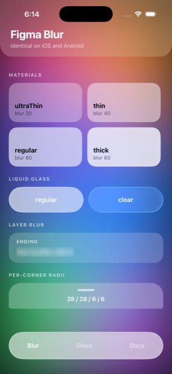
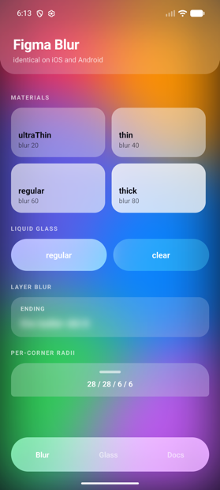
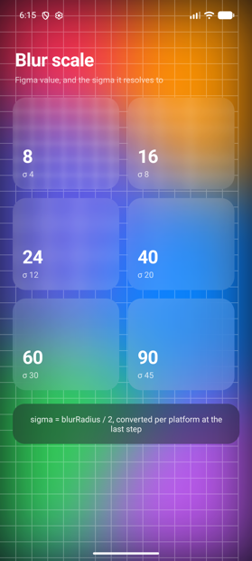

<h1 align="center">react-native-figma-blur</h1>

<p align="center">
  Blur and Liquid Glass that look <b>the same on iOS and Android</b> —<br/>
  and the same as the Figma file you were handed.
</p>

<p align="center">
  <a href="https://www.npmjs.com/package/react-native-figma-blur"></a>
  
  
  
</p>

| iOS 26 · iPhone 17 Pro | Android 16 · Pixel 6 |
|---|---|
|  |  |

<p align="center"><i>Same JSX. Same numbers. No per-platform branches.</i></p>

---

## Install

```sh
npm install react-native-figma-blur
```

```sh
yarn add react-native-figma-blur
```

Then rebuild the app — this package ships native code, so a Metro reload will not
pick it up:

```sh
cd ios && pod install && cd ..   # iOS only
npm run ios                      # or: npm run android
```

**Requirements:** React Native 0.76+ with the New Architecture, iOS 15.1+,
Android 7.0+ (blur is active on Android 12 / API 31 and up — see
[Platform support](#platform-support)).

## Your first blur

```tsx
import { FigmaBlurView } from 'react-native-figma-blur';

<FigmaBlurView blurRadius={40} style={{ borderRadius: 24, padding: 20 }}>
  <Text>Sharp text on a blurred backdrop</Text>
</FigmaBlurView>
```

That is the whole idea: **`blurRadius` is the number from Figma's inspector.**
Paste it in. You do not convert it, and you do not tune it per platform.

Two things to know straight away:

- Put it **over** something. A backdrop blur shows what is painted behind it, so
  with nothing behind it there is nothing to see.
- Use **`tintColor`**, not `backgroundColor`. The blur sits above the background
  and would hide it.

```tsx
<FigmaBlurView
  blurRadius={40}
  tintColor="rgba(255,255,255,0.45)"   // the fill from your Figma layer
  style={{ borderRadius: 24, padding: 20 }}
>
  <Text>Now it looks like the mock</Text>
</FigmaBlurView>
```

## Ready-made materials

If you just want a good-looking panel, start here instead of picking numbers:

```tsx
import { FigmaBlurView, Materials } from 'react-native-figma-blur';

<FigmaBlurView {...Materials.thin} style={{ borderRadius: 24 }} />
```

`ultraThin` · `thin` · `regular` · `thick`, each with a `…Dark` counterpart.

These are the recipes designers actually draw — a background blur plus a
translucent fill — so they match the mock rather than matching UIKit.

## Liquid Glass

```tsx
import { GlassView } from 'react-native-figma-blur';

<GlassView variant="regular" style={{ borderRadius: 28, height: 60 }}>
  <Text>Glass</Text>
</GlassView>
```

On iOS 26+ this is the platform's own glass material. On Android it is
synthesised in a runtime shader — edge refraction, specular rim and all — and
[colour-matched to iOS](docs/parity.md#measured-results) in both light and dark
mode.

## The blur scale

`blurRadius` is a Figma value; sigma is the Gaussian it resolves to. The grid
behind these tiles is there to be destroyed — it is what makes one step
distinguishable from the next.

| iOS | Android |
|---|---|
|  |  |

---

## Why not just use a blur library?

Three things go wrong when you try to match a Figma mock on both platforms, and
they compound:

1. **Every layer speaks a different unit.** Figma's blur value is 2× the sigma.
   CSS `blur()` *is* the sigma. Android's `RenderEffect` takes a Skia radius.
   Core Animation takes another. Pass the same number to each and you get four
   different blurs.
2. **iOS materials saturate.** `UIBlurEffect` boosts backdrop saturation by
   roughly 1.8×; Figma does not. This is why a stock iOS blur looks wrong beside
   the mock, and no amount of radius tuning fixes it.
3. **Downscaling softens.** The standard performance trick overshoots, because
   blurs compose in variance rather than sigma.

This library defines blur once — as a sigma — and converts per platform at the
last step. [How it works](docs/how-it-works.md) has the detail.

**And it is measured, not asserted.** At `blurRadius={40}`:

| | measured sigma | vs model (20.0) |
|---|---|---|
| iOS — iPhone 17 Pro | 19.59 dip | −2.1% |
| Android — Pixel 6 | 20.16 dip | +0.8% |
| **difference** | | **2.9%** |

You can run the check yourself: [`npm run parity`](docs/parity.md).

## Performance

Both platforms are GPU-only, with no per-frame bitmap anywhere.

**iOS** samples the backdrop through a `CABackdropLayer` — live GPU capture, so
it costs nothing extra while scrolling. **Android** records the ancestor tree
into a `RenderNode` and hangs a `RenderEffect` off it; the only CPU cost is a
display-list re-record, which scales with the number of views behind the blur
rather than its pixel area.

## API

### `<FigmaBlurView />`

| Prop | Type | Default | |
|---|---|---|---|
| `blurRadius` | `number` | `0` | Figma units — paste from the inspector |
| `blurMode` | `'backdrop' \| 'layer'` | `'backdrop'` | Figma's Background blur vs Layer blur |
| `tintColor` | `ColorValue` | — | Overlay fill above the blur |
| `saturation` | `number` | `1.0` | `1.0` is Figma-neutral; iOS materials ship ~1.8 |
| `downsampleFactor` | `number` | `0` | `0` picks from the radius |
| `noiseOpacity` | `number` | `0` | Grain, to dither banding on large flat blurs |
| `glass` | `'none' \| 'regular' \| 'clear'` | `'none'` | |
| `glassTintColor` | `ColorValue` | — | |
| `glassInteractive` | `boolean` | `false` | iOS 26+ only |
| `fallbackColor` | `ColorValue` | — | Painted where no GPU blur exists |
| `enabled` | `boolean` | `true` | Switch the blur off without unmounting |

Corner radii come from `style` — `borderRadius` and the per-corner variants — and
are applied to the blur's own mask.

### `<GlassView />`

`FigmaBlurView` with `glass` preset and a matching default radius. Takes
`variant` (`'regular' | 'clear'`).

### `Materials`

`ultraThin` · `thin` · `regular` · `thick`, plus `…Dark` variants.

### `getCapabilities()`

Reports which backend is live, whether the radius is exact, and whether glass is
native or synthesised. Worth including in bug reports.

```ts
{ hasBackdropBlur, hasExactRadius, hasNativeGlass, hasShaderGlass, engine, apiLevel }
```

## Platform support

| | Backdrop blur | Exact radius | Glass |
|---|---|---|---|
| iOS 26+ | ✅ | ✅ | ✅ native |
| iOS 15.1–25 | ✅ | ✅ | ⚠️ synthesised |
| Android 13+ (33) | ✅ | ✅ | ⚠️ synthesised |
| Android 12 (31–32) | ✅ | ✅ | ⚠️ blur + tint only |
| Android < 12 | ❌ `fallbackColor` | — | ❌ |

**Why Android 12 is the floor.** Below API 31 there is no GPU backdrop blur on
Android at all — only CPU bitmap blurring, which drops frames on exactly the
low-end devices it would exist to serve. Rather than pretend, the library paints
`fallbackColor`. The package still installs at minSdk 24.

### App Store note

The exact-radius path on iOS uses two private classes, `CABackdropLayer` and
`CAFilter`. They are used openly here — plain string literals, no obfuscation —
because you should be able to see exactly what is touched and decide for
yourself. They are the only way to set a real Gaussian radius on iOS.

Every lookup is nil-checked and every path degrades: if the classes are
unavailable the engine falls back to `UIVisualEffectView`, then to a fitted
intensity curve. A softer blur, never a crash.
`getCapabilities().hasExactRadius` tells you at runtime which one you got.

A build-time switch to remove the private symbols entirely is on the
[roadmap](ROADMAP.md).

## Documentation

- **[How it works](docs/how-it-works.md)** — the sigma model, and what each
  platform actually does
- **[Verifying parity](docs/parity.md)** — the harness, the measured numbers, and
  two ways measuring has already gone wrong
- **[Troubleshooting](docs/troubleshooting.md)** — start with `getCapabilities()`
- **[Roadmap](ROADMAP.md)** — what is next, and what is honestly not there yet

## Running the example

```bash
git clone https://github.com/mowgli/react-native-figma-blur
cd react-native-figma-blur
npm install && npm run prepare

cd example && npm install
cd ios && pod install && cd ..
npm run ios      # or: npm run android
```

Three screens, switchable from the picker: **gallery** and **scale** are the
plates above; **parity** is the measurement fixture — deliberately harsh, because
a soft backdrop hides a wrong sigma.

## Contributing

Very welcome — see [CONTRIBUTING.md](CONTRIBUTING.md). There is one rule that
matters: **a change to how a blur looks needs a measurement, not a screenshot.**
During development a blur shipped at 5× too weak and another at 48% too strong,
and both looked entirely plausible by eye.

## License

MIT © [mowgli](https://github.com/mowgli)
